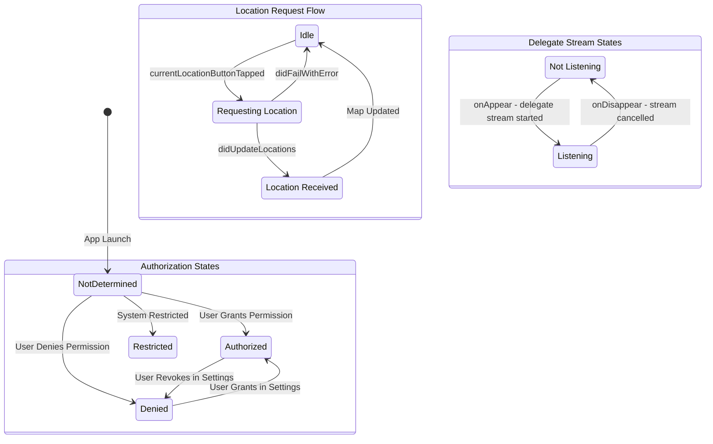
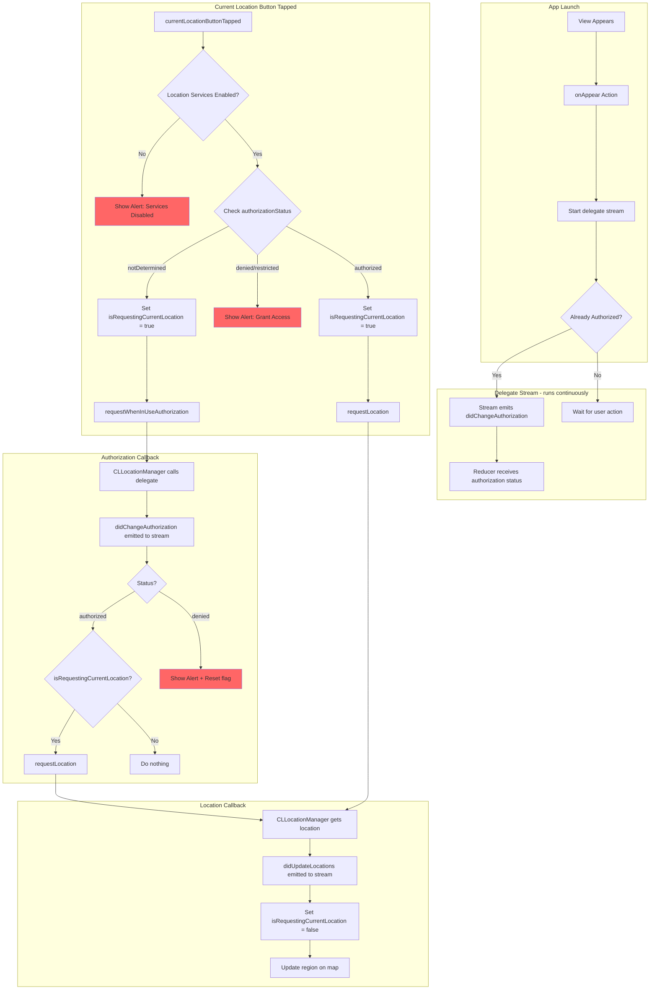

# Composable Core Location Flow Analysis

## Overview

This document analyzes the location manager flow in the `composable-core-location` example app, identifies bugs in the current implementation, and provides recommended fixes.

## State Diagram



## Detailed Flow Diagram



## Current Implementation Analysis

### AppCore.swift Flow

1. **onAppear**: Starts listening to the delegate stream

   ```swift
   case .onAppear:
     return .run { send in
       for await action in locationManager.delegate() {
         await send(.locationManager(action))
       }
     }
     .cancellable(id: CancelID.locationManager)
   ```

2. **currentLocationButtonTapped**: Checks authorization and requests location
   - If `notDetermined`: Sets flag, requests authorization
   - If `authorized`: Sets flag, calls `requestLocation()`
   - If `denied/restricted`: Shows alert

3. **didChangeAuthorization**: After authorization granted
   - If `isRequestingCurrentLocation` is true, calls `requestLocation()`

4. **didUpdateLocations**: Updates the map region

### Live.swift Implementation

The `LocationManagerHolder` class manages the delegate stream:

```swift
func delegate() -> AsyncStream<LocationManagerClient.Action> {
  lock.lock()
  defer { lock.unlock() }

  return AsyncStream { continuation in
    self.continuation = continuation
    let delegate = LocationManagerDelegate(continuation: continuation)
    self.delegateObject = delegate
    self.manager.delegate = delegate

    continuation.onTermination = { [weak self] _ in
      // Cleanup...
    }
  }
}
```

## Identified Bug

### The Race Condition Bug

**Problem**: When the app is already authorized and the user taps the "Current Location" button, the location is never received.

**Root Cause**: The delegate stream is created fresh each time `delegate()` is called. Looking at the flow:

1. `onAppear` calls `locationManager.delegate()` - this creates a NEW delegate and sets it on the manager
2. When `currentLocationButtonTapped` is received with authorization already granted:
   - It calls `requestLocation()`
   - The location manager will call `didUpdateLocations` on its delegate
   - The delegate yields to the continuation
   - **BUT** the stream is being consumed by the `for await` loop in `onAppear`

**The actual bug is more subtle**: Looking at [`Live.swift:295-314`](references/composable-core-location/Sources/ComposableCoreLocation/Live.swift:295), each call to `delegate()` creates a new `AsyncStream` and sets a new delegate. If `delegate()` is called multiple times, only the last stream will receive events.

However, in the current [`AppCore.swift`](references/composable-core-location/Examples/LocationManager/Common/AppCore.swift) implementation, `delegate()` is only called once in `onAppear`, so this should work correctly.

### The Real Bug: Missing Initial Authorization Event

**Actual Problem**: When the app launches and is already authorized, the `CLLocationManager` may not emit a `didChangeAuthorization` event because the authorization hasn't changed - it was already authorized.

Looking at the flow:

1. App launches, already authorized
2. `onAppear` starts the delegate stream
3. User taps "Current Location" button
4. Since already authorized, it calls `requestLocation()`
5. `requestLocation()` should trigger `didUpdateLocations`

**Wait - this should work!** Let me re-examine...

### The Actual Bug: Delegate Not Set Before requestLocation

Looking more carefully at the timing:

1. `onAppear` runs and starts the delegate stream
2. Inside the `AsyncStream` initializer, the delegate is set: `self.manager.delegate = delegate`
3. User taps button, `requestLocation()` is called
4. Location manager should call delegate

**The bug is in the `LocationManagerHolder` singleton pattern!**

In [`Live.swift:56-58`](references/composable-core-location/Sources/ComposableCoreLocation/Live.swift:56):

```swift
public static var liveValue: Self {
  let holder = LocationManagerHolder()
  // ...
}
```

Each access to `liveValue` creates a NEW `LocationManagerHolder`! This means:

- The `locationManager` dependency might be accessed multiple times
- Each access creates a new holder with a new `CLLocationManager`
- The delegate stream is on one manager, but `requestLocation()` might be called on a different manager

**However**, with `@Dependency`, the `liveValue` is typically cached per scope, so this might not be the issue.

### Most Likely Bug: desiredAccuracy Not Set

Looking at Apple's documentation for `requestLocation()`:

> Requests the one-time delivery of the user's current location.
>
> This method returns immediately. Calling it causes the location manager to obtain a location fix (which may take several seconds) and call the delegate's `locationManager(_:didUpdateLocations:)` method with the result.

**Key requirement**: The location manager must have `desiredAccuracy` set appropriately. If not configured, `requestLocation()` may fail silently or take a very long time.

Looking at [`AppCore.swift`](references/composable-core-location/Examples/LocationManager/Common/AppCore.swift), there's no call to `locationManager.set(desiredAccuracy: ...)` before requesting location!

## Recommended Fixes

### Fix 1: Set desiredAccuracy Before Requesting Location

```swift
case .currentLocationButtonTapped:
  // ... existing checks ...

  case .authorizedAlways, .authorizedWhenInUse:
    state.isRequestingCurrentLocation = true
    return .run { _ in
      // Set accuracy before requesting
      await locationManager.set(desiredAccuracy: kCLLocationAccuracyBest)
      await locationManager.requestLocation()
    }
```

### Fix 2: Handle didFailWithError

The current implementation ignores errors:

```swift
case .locationManager:
  return .none
```

This catches `didFailWithError` but does nothing. Add proper error handling:

```swift
case let .locationManager(.didFailWithError(error)):
  state.isRequestingCurrentLocation = false
  state.alert = AlertState {
    TextState("Failed to get location: \(error.error.localizedDescription)")
  }
  return .none
```

### Fix 3: Ensure Delegate Stream Starts Before Any Location Requests

The current implementation starts the delegate stream in `onAppear`, which is correct. However, ensure the stream is active before any location requests by checking the effect is running.

### Fix 4: Add Timeout for Location Requests

`requestLocation()` can take a long time or fail silently. Add a timeout:

```swift
case .authorizedAlways, .authorizedWhenInUse:
  state.isRequestingCurrentLocation = true
  return .run { send in
    await locationManager.set(desiredAccuracy: kCLLocationAccuracyHundredMeters)
    await locationManager.requestLocation()
  }
  .merge(with:
    .run { send in
      try await Task.sleep(for: .seconds(10))
      await send(.locationRequestTimeout)
    }
    .cancellable(id: CancelID.locationTimeout)
  )
```

## Summary of Issues

| Issue                           | Severity | Fix                                                     |
| ------------------------------- | -------- | ------------------------------------------------------- |
| No `desiredAccuracy` set        | High     | Call `set(desiredAccuracy:)` before `requestLocation()` |
| `didFailWithError` ignored      | Medium   | Add error handling case                                 |
| No timeout for location request | Low      | Add timeout with cancellation                           |
| Silent failures                 | Medium   | Add logging or user feedback                            |

## Testing Recommendations

1. **Test with fresh install**: Ensure authorization flow works from `notDetermined`
2. **Test with pre-authorized**: Ensure location works when already authorized
3. **Test with denied permission**: Ensure alert is shown
4. **Test location failure**: Simulate location failure and verify error handling
5. **Test in simulator**: Note that simulator location may behave differently than device
