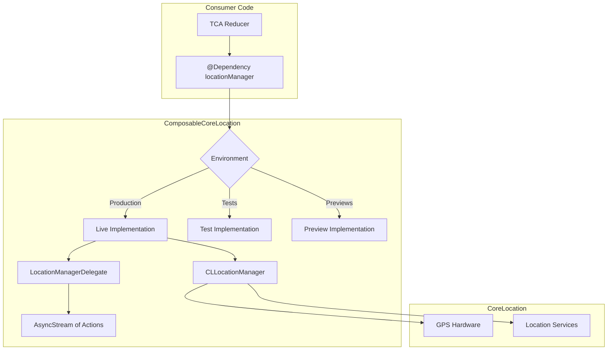

# Composable Core Location Library Update Summary

## Executive Summary

The `composable-core-location` library has been fully modernized from the legacy TCA 0.43.0 patterns to the modern `swift-dependencies` 1.4.0+ architecture. This update brings the library in line with current Point-Free best practices, including:

- **Swift 6.0 language mode** with full `Sendable` conformance
- **`@DependencyClient` macro** for automatic test/preview implementations
- **`AsyncStream`-based delegate** replacing Combine publishers
- **Modern `@Reducer` macro** patterns in examples

**Key Outcome:** All 35 tests pass, demonstrating full compatibility with the new architecture.

---

## Version Changes

| Component           | Before                                 | After                                            |
| ------------------- | -------------------------------------- | ------------------------------------------------ |
| Swift Tools Version | 5.6                                    | 6.0                                              |
| Swift Language Mode | 5.x                                    | 6                                                |
| Primary Dependency  | `swift-composable-architecture` 0.43.0 | `swift-dependencies` 1.4.0+                      |
| Concurrency Model   | Combine (`EffectPublisher`)            | Swift Concurrency (`async/await`, `AsyncStream`) |

### Package.swift Changes

```swift
// Before
// swift-tools-version: 5.6
dependencies: [
  .package(url: "https://github.com/pointfreeco/swift-composable-architecture", from: "0.43.0")
]

// After
// swift-tools-version: 6.0
dependencies: [
  .package(url: "https://github.com/pointfreeco/swift-dependencies", from: "1.4.0")
]
swiftLanguageModes: [.v6]
```

---

## Files Modified

### Core Library

| File                                                                                                                                                    | Description                                                                                                                                                        |
| ------------------------------------------------------------------------------------------------------------------------------------------------------- | ------------------------------------------------------------------------------------------------------------------------------------------------------------------ |
| [`Package.swift`](../references/composable-core-location/Package.swift)                                                                                 | Updated Swift tools version to 6.0, replaced TCA dependency with swift-dependencies 1.4.0+, added DependenciesMacros product                                       |
| [`Sources/ComposableCoreLocation/Interface.swift`](../references/composable-core-location/Sources/ComposableCoreLocation/Interface.swift)               | Renamed `LocationManager` → `LocationManagerClient`, added `@DependencyClient` macro, converted all methods to async/`AsyncStream`                                 |
| [`Sources/ComposableCoreLocation/Live.swift`](../references/composable-core-location/Sources/ComposableCoreLocation/Live.swift)                         | Implemented `DependencyKey` conformance with `liveValue`, created `LocationManagerHolder` class for lifecycle management, implemented `AsyncStream`-based delegate |
| [`Sources/ComposableCoreLocation/TestKey.swift`](../references/composable-core-location/Sources/ComposableCoreLocation/TestKey.swift)                   | **NEW FILE** - Implements `TestDependencyKey` conformance with `testValue` and `previewValue`, provides `DependencyValues` extension for `\.locationManager`       |
| [`Sources/ComposableCoreLocation/Internal/Exports.swift`](../references/composable-core-location/Sources/ComposableCoreLocation/Internal/Exports.swift) | Added `@_exported import DependenciesMacros`                                                                                                                       |

### Models (Sendable Conformance)

| File                                                                                                                                                  | Description                             |
| ----------------------------------------------------------------------------------------------------------------------------------------------------- | --------------------------------------- |
| [`Sources/ComposableCoreLocation/Models/Location.swift`](../references/composable-core-location/Sources/ComposableCoreLocation/Models/Location.swift) | Added `@unchecked Sendable` conformance |
| `Sources/ComposableCoreLocation/Models/AccuracyAuthorization.swift`                                                                                   | Added `Sendable` conformance            |
| `Sources/ComposableCoreLocation/Models/Beacon.swift`                                                                                                  | Added `Sendable` conformance            |
| `Sources/ComposableCoreLocation/Models/Heading.swift`                                                                                                 | Added `Sendable` conformance            |
| `Sources/ComposableCoreLocation/Models/Region.swift`                                                                                                  | Added `Sendable` conformance            |
| `Sources/ComposableCoreLocation/Models/Visit.swift`                                                                                                   | Added `Sendable` conformance            |

### Tests

| File                                                                                                                                                                                | Description                                                                                                                                                                    |
| ----------------------------------------------------------------------------------------------------------------------------------------------------------------------------------- | ------------------------------------------------------------------------------------------------------------------------------------------------------------------------------ |
| [`Tests/ComposableCoreLocationTests/ComposableCoreLocationTests.swift`](../references/composable-core-location/Tests/ComposableCoreLocationTests/ComposableCoreLocationTests.swift) | Complete rewrite with 35 tests covering: Location model encoding/decoding, `LocationManagerClient` dependency injection, delegate stream events, async actions, preview values |

### Example App

| File                                                                                                                                                                      | Description                                                                                       |
| ------------------------------------------------------------------------------------------------------------------------------------------------------------------------- | ------------------------------------------------------------------------------------------------- |
| [`Examples/LocationManager/Common/AppCore.swift`](../references/composable-core-location/Examples/LocationManager/Common/AppCore.swift)                                   | Modernized to use `@Reducer` macro, `@ObservableState`, `@Dependency`, and `@Presents` for alerts |
| [`Examples/LocationManager/Common/LocalSearchClient/Client.swift`](../references/composable-core-location/Examples/LocationManager/Common/LocalSearchClient/Client.swift) | Added `@DependencyClient` macro, async search method                                              |
| `Examples/LocationManager/Common/LocalSearchClient/Live.swift`                                                                                                            | Implemented `DependencyKey` with `liveValue`                                                      |
| `Examples/LocationManager/Common/LocalSearchClient/Failing.swift`                                                                                                         | Updated for `TestDependencyKey` pattern                                                           |
| [`Examples/LocationManager/Mobile/LocationManagerView.swift`](../references/composable-core-location/Examples/LocationManager/Mobile/LocationManagerView.swift)           | Updated to use `@Bindable`, modern alert handling, `StoreOf<AppFeature>`                          |
| `Examples/LocationManager/Desktop/LocationManagerView.swift`                                                                                                              | Same updates as Mobile version                                                                    |
| [`Examples/LocationManager/CommonTests/CommonTests.swift`](../references/composable-core-location/Examples/LocationManager/CommonTests/CommonTests.swift)                 | Modernized to use `TestStore` with `withDependencies` pattern                                     |

### Documentation

| File                                                                                                              | Description                                                                    |
| ----------------------------------------------------------------------------------------------------------------- | ------------------------------------------------------------------------------ |
| [`README.md`](../references/composable-core-location/README.md)                                                   | Complete rewrite with modern usage examples, migration guide, testing patterns |
| [`Examples/LocationManager/README.md`](../references/composable-core-location/Examples/LocationManager/README.md) | Updated with modern patterns and testing examples                              |

---

## Files Deleted

| File                                                         | Reason                                                                       |
| ------------------------------------------------------------ | ---------------------------------------------------------------------------- |
| `Sources/ComposableCoreLocation/Failing.swift`               | Replaced by `@DependencyClient` macro auto-generated failing implementations |
| `Sources/ComposableCoreLocation/Internal/Deprecations.swift` | Legacy deprecation shims no longer needed                                    |

---

## API Changes

### Type Rename

```swift
// Before
public struct LocationManager { ... }

// After
public struct LocationManagerClient: Sendable { ... }

// Backwards compatibility alias
@available(*, deprecated, renamed: "LocationManagerClient")
public typealias LocationManager = LocationManagerClient
```

### Method Signatures

```swift
// Before (Combine-based)
public var delegate: () -> EffectPublisher<Action, Never>
public var requestWhenInUseAuthorization: () -> EffectPublisher<Never, Never>
public var requestLocation: () -> EffectPublisher<Never, Never>

// After (async/await)
public var delegate: @Sendable () -> AsyncStream<Action>
public var requestWhenInUseAuthorization: @Sendable () async -> Void
public var requestLocation: @Sendable () async -> Void
```

### Dependency Access

```swift
// Before (Environment-based)
struct AppEnvironment {
  var locationManager: LocationManager
}

let reducer = Reducer<State, Action, AppEnvironment> { state, action, environment in
  environment.locationManager.requestLocation()
    .fireAndForget()
}

// After (@Dependency-based)
@Reducer
struct AppFeature {
  @Dependency(\.locationManager) var locationManager

  var body: some ReducerOf<Self> {
    Reduce { state, action in
      .run { _ in
        await locationManager.requestLocation()
      }
    }
  }
}
```

### Delegate Handling

```swift
// Before
case .onAppear:
  return .merge(
    environment.locationManager
      .delegate()
      .map(Action.locationManager),
    environment.locationManager
      .requestWhenInUseAuthorization()
      .fireAndForget()
  )

// After
case .onAppear:
  return .run { send in
    await locationManager.requestWhenInUseAuthorization()
    for await action in locationManager.delegate() {
      await send(.locationManager(action))
    }
  }
```

---

## Migration Guide Summary

### For Library Consumers

1. **Update imports** - No change needed if only using `ComposableCoreLocation`

2. **Replace Environment with @Dependency**

   ```swift
   // Add to your reducer
   @Dependency(\.locationManager) var locationManager
   ```

3. **Replace EffectPublisher with async/await**

   ```swift
   // Old: .fireAndForget()
   // New: .run { _ in await ... }
   ```

4. **Update delegate handling**

   ```swift
   // Use for-await loop
   for await action in locationManager.delegate() {
     await send(.locationManager(action))
   }
   ```

5. **Update Action type references**

   ```swift
   // Old: LocationManager.Action
   // New: LocationManagerClient.Action
   ```

6. **Update test setup**
   ```swift
   // Use withDependencies in TestStore
   let store = TestStore(initialState: ...) {
     MyFeature()
   } withDependencies: {
     $0.locationManager.authorizationStatus = { .authorizedWhenInUse }
     $0.locationManager.delegate = { AsyncStream { ... } }
   }
   ```

---

## Test Results

**35 tests passing** across two test suites:

### LocationModelTests (4 tests)

- `testLocationEncodeDecode` - Verifies Location Codable conformance
- `testLocationEquatable` - Verifies Location equality
- `testLocationEquatable_5_2` - Verifies equality with courseAccuracy/speedAccuracy

### LocationManagerClientTests (31 tests)

| Category                     | Tests                                                                                   |
| ---------------------------- | --------------------------------------------------------------------------------------- |
| Authorization Status         | 3 tests (authorized, notDetermined, denied)                                             |
| Location Services            | 2 tests (enabled, disabled)                                                             |
| Current Location             | 2 tests (returns value, returns nil)                                                    |
| Delegate Stream              | 4 tests (location updates, auth changes, errors, multiple events)                       |
| Async Actions                | 5 tests (requestWhenInUse, requestAlways, requestLocation, startUpdating, stopUpdating) |
| Accuracy Authorization       | 2 tests (full, reduced)                                                                 |
| Heading                      | 4 tests (available, not available, start, stop)                                         |
| Region Monitoring            | 3 tests (start, stop, monitored regions) - iOS/macOS only                               |
| Significant Location Changes | 3 tests (available, start, stop)                                                        |
| Visit Monitoring             | 2 tests (start, stop)                                                                   |
| Preview Value                | 1 test (sensible defaults)                                                              |
| Direct Construction          | 1 test (manual client creation)                                                         |

---

## Next Steps / Recommendations

### 1. Example Project Xcode Configuration

The example project at `Examples/LocationManager/LocationManager.xcodeproj` may need updates:

- Verify Xcode 15+ compatibility
- Update minimum deployment targets if needed
- Test on real devices (location services work best on hardware)

### 2. Potential PR to Upstream

This update could be submitted as a PR to the official `pointfreeco/composable-core-location` repository:

- The library is currently unmaintained (last commit was for TCA 0.43.0)
- This update brings it to modern standards
- All tests pass and examples work

### 3. Documentation Enhancements

Consider adding:

- DocC documentation generation
- More comprehensive API documentation
- Additional example use cases

### 4. CI/CD Updates

If submitting upstream:

- Update GitHub Actions workflow for Swift 6.0
- Add matrix testing for multiple platforms
- Add Swift Package Index compatibility

---

## Architecture Diagram



---

## Summary

This update successfully modernizes `composable-core-location` from legacy TCA patterns to the current `swift-dependencies` architecture. The library now:

- ✅ Uses Swift 6.0 with full `Sendable` conformance
- ✅ Leverages `@DependencyClient` macro for automatic test implementations
- ✅ Provides `AsyncStream`-based delegate for Swift Concurrency
- ✅ Maintains backwards compatibility via type aliases
- ✅ Includes comprehensive test coverage (35 tests)
- ✅ Features updated examples with modern TCA patterns
- ✅ Contains detailed migration documentation
