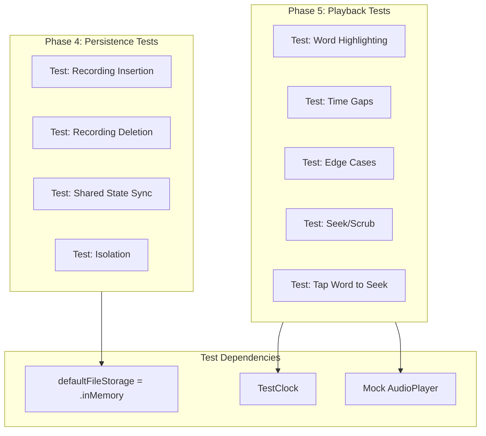

# Speech Recorder App Testing Strategy

## Overview

This document outlines the testing strategy for Phase 4 (Swift Sharing Persistence) and Phase 5 (Synchronized Playback) of the Speech Recorder App, based on patterns from:

- [Swift Sharing Testing Documentation](../references/swift-sharing/Sources/Sharing/Documentation.docc/Articles/Testing.md)
- [TCA Sharing State Documentation](../references/swift-composable-architecture/Sources/ComposableArchitecture/Documentation.docc/Articles/SharingState.md)
- [VoiceMemos Example Tests](../references/swift-composable-architecture/Examples/VoiceMemos/VoiceMemosTests/VoiceMemosTests.swift)

## Phase 4: Swift Sharing Persistence Testing

### Key Insights from References

1. **Automatic Test Isolation**: Each test gets a fresh storage system quarantined to that test. Changes made in one test won't affect other tests.

2. **In-Memory Storage for Tests**: Use `$0.defaultFileStorage = .inMemory` to prevent actual file system writes during tests.

3. **Shared State Mutation Pattern**: Use `$0.$recordings.withLock { $0 = ... }` for thread-safe mutations.

4. **TestStore Shared State Assertions**: When shared state is mutated in effects, use `store.assert { }` to verify changes.

### Test Cases for RecordingsListFeature

```swift
// Test 1: Recording insertion after successful recording
@Test("Recording is added to shared list after successful recording")
func recordingAddedAfterSuccess() async {
    // Declare shared state at test start to set initial value
    @Shared(.recordings) var recordings: [Recording] = []

    let store = await TestStore(initialState: RecordingsListFeature.State()) {
        RecordingsListFeature()
    } withDependencies: {
        $0.defaultFileStorage = .inMemory
    }

    let newRecording = Recording.preview()

    await store.send(.recording(.presented(.delegate(.didFinish(.success(newRecording)))))) {
        $0.recording = nil
    }

    // Assert shared state was updated
    store.assert {
        $0.$recordings.withLock { $0 = [newRecording] }
    }
}

// Test 2: Recording deletion removes from list
@Test("Delete recordings removes from shared list")
func deleteRecordingsRemovesFromList() async {
    let recording1 = Recording.preview(id: UUID())
    let recording2 = Recording.preview(id: UUID())

    // Pre-populate shared state
    @Shared(.recordings) var recordings = [recording1, recording2]

    let store = await TestStore(initialState: RecordingsListFeature.State()) {
        RecordingsListFeature()
    } withDependencies: {
        $0.defaultFileStorage = .inMemory
    }

    await store.send(.deleteRecordings(IndexSet(integer: 0))) {
        // Shared state mutation happens in reducer
    }

    // Verify shared state
    #expect(recordings == [recording2])
}

// Test 3: Multiple features share the same recordings
@Test("Multiple features see same shared recordings")
func multipleFeaturesSeeSharedRecordings() async {
    @Shared(.recordings) var recordings: [Recording] = []

    let store1 = await TestStore(initialState: RecordingsListFeature.State()) {
        RecordingsListFeature()
    } withDependencies: {
        $0.defaultFileStorage = .inMemory
    }

    let store2 = await TestStore(initialState: RecordingsListFeature.State()) {
        RecordingsListFeature()
    } withDependencies: {
        $0.defaultFileStorage = .inMemory
    }

    let newRecording = Recording.preview()

    // Add via store1
    await store1.send(.recording(.presented(.delegate(.didFinish(.success(newRecording)))))) {
        $0.recording = nil
    }

    // Both stores should see the recording
    #expect(store1.state.recordings == [newRecording])
    #expect(store2.state.recordings == [newRecording])
}
```

### Type-Safe Key Pattern

The current implementation already follows the type-safe key pattern:

```swift
extension SharedReaderKey where Self == FileStorageKey<[Recording]> {
    static var recordings: Self {
        .fileStorage(.documentsDirectory.appending(component: "recordings.json"))
    }
}
```

This ensures type safety - you can't accidentally use the wrong type with `.recordings`.

## Phase 5: Synchronized Playback Testing

### Key Insights from VoiceMemos Example

1. **TestClock for Time Control**: Use `TestClock` to control time advancement in tests.

2. **Timer-Based Progress Updates**: The VoiceMemos example uses a timer to update playback progress.

3. **Pure State Word Index Calculation**: The `findWordIndex(at:in:)` function is a pure function that can be tested independently.

### Pure State Approach for Word Highlighting

The current implementation uses a pure function for word index calculation:

```swift
private func findWordIndex(at time: TimeInterval, in words: [TimestampedWord]) -> Int? {
    words.firstIndex { word in
        time >= word.startTime && time < word.endTime
    }
}
```

This is the idiomatic TCA approach - keep logic pure and testable.

### Test Cases for PlaybackFeature

```swift
// Test 1: Word highlighting with TestClock
@Test("Playback updates word index as time progresses")
func playbackUpdatesWordIndex() async {
    let clock = TestClock()

    let recording = Recording.preview(
        transcription: Transcription(
            text: "Hello world test",
            words: [
                .preview(text: "Hello", startTime: 0.0, endTime: 0.5),
                .preview(text: "world", startTime: 0.5, endTime: 1.0),
                .preview(text: "test", startTime: 1.0, endTime: 1.5)
            ],
            isFinal: true
        )
    )

    var currentTime: TimeInterval = 0

    let store = await TestStore(
        initialState: PlaybackFeature.State(recording: recording)
    ) {
        PlaybackFeature()
    } withDependencies: {
        $0.audioPlayer.play = { @Sendable _ in
            try await clock.sleep(for: .milliseconds(1500))
        }
        $0.audioPlayer.currentTime = { currentTime }
        $0.continuousClock = clock
    }

    await store.send(.playButtonTapped) {
        $0.isPlaying = true
    }

    // Advance time and verify word highlighting
    currentTime = 0.25
    await clock.advance(by: .milliseconds(50))
    await store.receive(.timeUpdated(0.25)) {
        $0.currentTime = 0.25
        $0.currentWordIndex = 0  // "Hello"
    }

    currentTime = 0.75
    await clock.advance(by: .milliseconds(500))
    await store.receive(.timeUpdated(0.75)) {
        $0.currentTime = 0.75
        $0.currentWordIndex = 1  // "world"
    }

    currentTime = 1.25
    await clock.advance(by: .milliseconds(500))
    await store.receive(.timeUpdated(1.25)) {
        $0.currentTime = 1.25
        $0.currentWordIndex = 2  // "test"
    }
}

// Test 2: Edge case - time between words
@Test("Time between words returns nil index")
func timeBetweenWordsReturnsNil() async {
    let recording = Recording.preview(
        transcription: Transcription(
            text: "Hello world",
            words: [
                .preview(text: "Hello", startTime: 0.0, endTime: 0.4),
                // Gap from 0.4 to 0.6
                .preview(text: "world", startTime: 0.6, endTime: 1.0)
            ],
            isFinal: true
        )
    )

    let store = await TestStore(
        initialState: PlaybackFeature.State(recording: recording)
    ) {
        PlaybackFeature()
    }

    // Time 0.5 is in the gap between words
    await store.send(.timeUpdated(0.5)) {
        $0.currentTime = 0.5
        $0.currentWordIndex = nil  // No word at this time
    }
}

// Test 3: Edge case - time after all words
@Test("Time after all words returns nil index")
func timeAfterAllWordsReturnsNil() async {
    let recording = Recording.preview(
        transcription: Transcription(
            text: "Hello",
            words: [
                .preview(text: "Hello", startTime: 0.0, endTime: 0.5)
            ],
            isFinal: true
        )
    )

    let store = await TestStore(
        initialState: PlaybackFeature.State(recording: recording)
    ) {
        PlaybackFeature()
    }

    // Time 1.0 is after all words
    await store.send(.timeUpdated(1.0)) {
        $0.currentTime = 1.0
        $0.currentWordIndex = nil
    }
}

// Test 4: Edge case - empty transcription
@Test("Empty transcription always returns nil index")
func emptyTranscriptionReturnsNil() async {
    let recording = Recording.preview(
        transcription: Transcription(
            text: "",
            words: [],
            isFinal: true
        )
    )

    let store = await TestStore(
        initialState: PlaybackFeature.State(recording: recording)
    ) {
        PlaybackFeature()
    }

    await store.send(.timeUpdated(0.5)) {
        $0.currentTime = 0.5
        $0.currentWordIndex = nil
    }
}

// Test 5: Seek to specific time (scrubbing)
@Test("Seek to time highlights correct word")
func seekToTimeHighlightsWord() async {
    let recording = Recording.preview(
        transcription: Transcription(
            text: "Hello world test",
            words: [
                .preview(text: "Hello", startTime: 0.0, endTime: 0.5),
                .preview(text: "world", startTime: 0.5, endTime: 1.0),
                .preview(text: "test", startTime: 1.0, endTime: 1.5)
            ],
            isFinal: true
        )
    )

    let store = await TestStore(
        initialState: PlaybackFeature.State(recording: recording)
    ) {
        PlaybackFeature()
    } withDependencies: {
        $0.audioPlayer.seek = { _ in }
    }

    // Seek directly to "world"
    await store.send(.seekTo(0.75)) {
        $0.currentTime = 0.75
        $0.currentWordIndex = 1
    }

    // Seek to "test"
    await store.send(.seekTo(1.25)) {
        $0.currentTime = 1.25
        $0.currentWordIndex = 2
    }
}

// Test 6: Tap word to seek to that word's start time
@Test("Tap word seeks to word start time")
func tapWordSeeksToWordStart() async {
    let recording = Recording.preview(
        transcription: Transcription(
            text: "Hello world test",
            words: [
                .preview(text: "Hello", startTime: 0.0, endTime: 0.5),
                .preview(text: "world", startTime: 0.5, endTime: 1.0),
                .preview(text: "test", startTime: 1.0, endTime: 1.5)
            ],
            isFinal: true
        )
    )

    let store = await TestStore(
        initialState: PlaybackFeature.State(recording: recording)
    ) {
        PlaybackFeature()
    } withDependencies: {
        $0.audioPlayer.seek = { _ in }
    }

    // Tap on "world" (index 1) - should seek to 0.5
    await store.send(.wordTapped(1)) {
        $0.currentTime = 0.5
        $0.currentWordIndex = 1
    }

    // Tap on "test" (index 2) - should seek to 1.0
    await store.send(.wordTapped(2)) {
        $0.currentTime = 1.0
        $0.currentWordIndex = 2
    }
}

// Test 7: Tap word with invalid index does nothing
@Test("Tap word with invalid index does nothing")
func tapWordInvalidIndexDoesNothing() async {
    let recording = Recording.preview(
        transcription: Transcription(
            text: "Hello",
            words: [
                .preview(text: "Hello", startTime: 0.0, endTime: 0.5)
            ],
            isFinal: true
        )
    )

    let store = await TestStore(
        initialState: PlaybackFeature.State(recording: recording)
    ) {
        PlaybackFeature()
    }

    // Tap on invalid index - should not change state
    await store.send(.wordTapped(5))
    // No state change expected
}
```

## Testing Best Practices

### 1. Use `defaultFileStorage = .inMemory` for All Tests

```swift
let store = await TestStore(initialState: ...) {
    ...
} withDependencies: {
    $0.defaultFileStorage = .inMemory
}
```

### 2. Declare Shared State at Test Start for Initial Values

```swift
@Test
func myTest() async {
    @Shared(.recordings) var recordings = [Recording.preview()]
    // Now all features using @Shared(.recordings) will see this value
}
```

### 3. Use `store.assert { }` for Shared State Mutations in Effects

```swift
await store.send(.someAction)
store.assert {
    $0.$recordings.withLock { $0 = expectedValue }
}
```

### 4. Use TestClock for Time-Based Tests

```swift
let clock = TestClock()
// ...
$0.continuousClock = clock
// ...
await clock.advance(by: .seconds(1))
```

### 5. Test Pure Functions Independently

The `findWordIndex(at:in:)` function could be extracted and tested directly:

```swift
@Test("findWordIndex returns correct index")
func findWordIndexTest() {
    let words = [
        TimestampedWord.preview(text: "Hello", startTime: 0.0, endTime: 0.5),
        TimestampedWord.preview(text: "world", startTime: 0.5, endTime: 1.0)
    ]

    #expect(findWordIndex(at: 0.25, in: words) == 0)
    #expect(findWordIndex(at: 0.75, in: words) == 1)
    #expect(findWordIndex(at: 1.5, in: words) == nil)
}
```

## Implementation Checklist

### Phase 4: Swift Sharing Persistence

- [ ] Add test for recording insertion after successful recording
- [ ] Add test for recording deletion with file cleanup
- [ ] Add test for multiple features sharing same recordings
- [ ] Verify `defaultFileStorage = .inMemory` is used in all tests
- [ ] Add test for persistence isolation between tests

### Phase 5: Synchronized Playback

- [ ] Add `wordTapped(Int)` action to PlaybackFeature
- [ ] Add test for word highlighting with TestClock
- [ ] Add test for time between words (gap handling)
- [ ] Add test for time after all words
- [ ] Add test for empty transcription
- [ ] Add test for seek to specific time (scrubbing)
- [ ] Add test for tap word to seek
- [ ] Add test for tap word with invalid index
- [ ] Consider extracting `findWordIndex` for direct testing

## Mermaid Diagram: Test Flow



## PlaybackFeature Action Updates

The PlaybackFeature needs a new action for tapping on words:

```swift
enum Action: Sendable {
    // Existing actions...
    case playButtonTapped
    case pauseButtonTapped
    case seekTo(TimeInterval)  // For scrubbing/slider
    case timeUpdated(TimeInterval)
    case playbackFinished
    case closeButtonTapped
    case delegate(Delegate)

    // NEW: Tap on a word to seek to its start time
    case wordTapped(Int)  // Index of the word tapped
}
```

And the reducer case:

```swift
case let .wordTapped(index):
    guard index >= 0 && index < state.recording.transcription.words.count else {
        return .none
    }
    let word = state.recording.transcription.words[index]
    state.currentTime = word.startTime
    state.currentWordIndex = index

    return .run { [startTime = word.startTime] _ in
        await audioPlayer.seek(startTime)
    }
```

## Next Steps

1. Switch to Code mode to implement the tests
2. Add `wordTapped(Int)` action to PlaybackFeature
3. Run tests to verify all pass
4. Commit and push changes
5. Update progress.md
