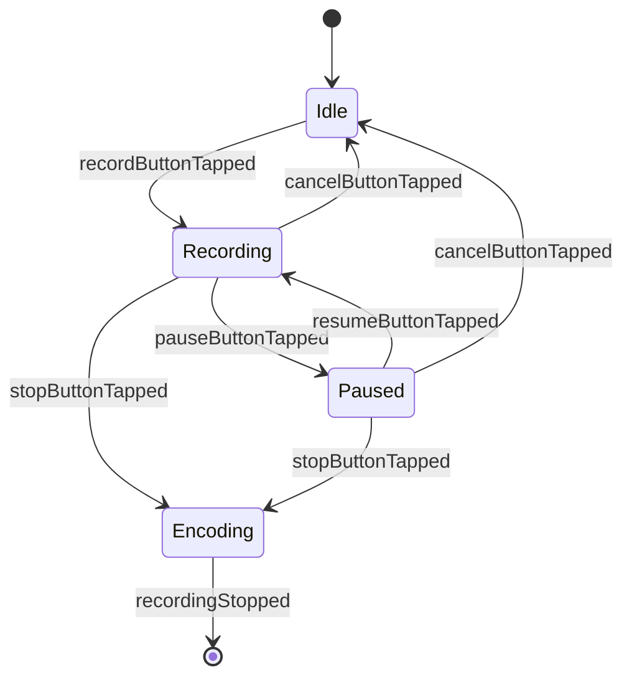
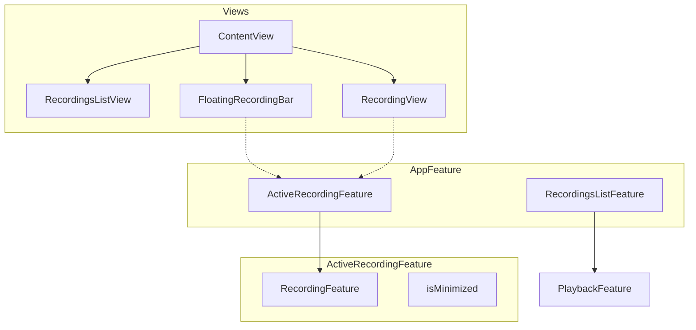
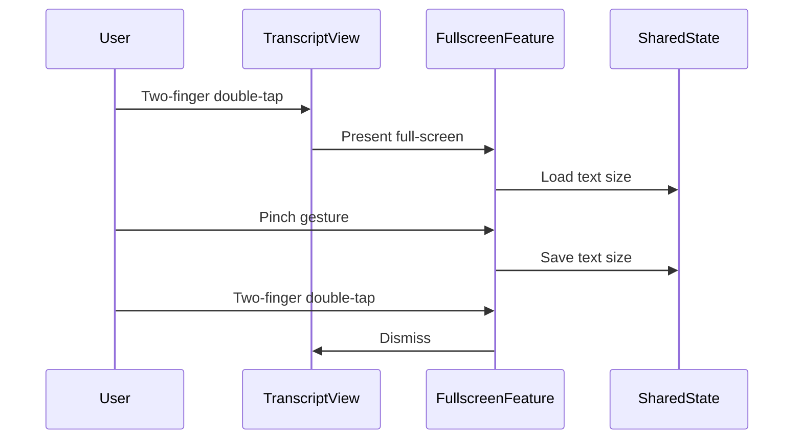

# Speech Recorder App UI Overhaul Plan

## Overview

This document outlines a comprehensive UI overhaul for the SpeechRecorderApp, inspired by Otter.ai and Apple Voice Memos. The goal is to create a cleaner, more functional recording and playback experience with features like collapsible modals, full-screen mode, and improved auto-scroll behavior.

## Design Principles

1. **Maximize transcript visibility** - Reduce padding, remove unnecessary UI elements
2. **Consistent experience** - Recording and playback share the same transcript UI
3. **Non-intrusive controls** - Compact waveform and controls at the bottom
4. **Flexible viewing** - Full-screen mode with pinch-to-zoom text
5. **Background recording** - Continue recording while browsing the app

---

## Phase 1: Core UI Improvements - Recording Screen ✅

### 1.1 Editable Title with Date/Time Display ✅

**Current State:**

- Title is set after recording completes
- No date/time display during recording

**New Design:**

```
┌─────────────────────────────────────────┐
│  [Editable Title Field]                 │
│  December 10th, 2024 at 12:25 PM EST    │
│  Duration: 00:05:32                     │
├─────────────────────────────────────────┤
│                                         │
│  [Transcript Area]                      │
│                                         │
└─────────────────────────────────────────┘
```

**Files to Modify:**

- [`RecordingView.swift`](../apps/SpeechRecorderApp/SpeechRecorderApp/Views/RecordingView.swift) - Add header with title and date
- [`RecordingFeature.swift`](../apps/SpeechRecorderApp/SpeechRecorderApp/Features/RecordingFeature.swift) - Add `title` state property
- [`Recording.swift`](../apps/SpeechRecorderApp/SpeechRecorderApp/Models/Recording.swift) - Already has title field

**Implementation Details:**

- Default title format: "December 10th, 2024 at 12:25 PM EST"
- Use `DateFormatter` with custom format for human-readable date
- Title is editable via inline `TextField`
- Show timezone abbreviation (EST, PST, etc.)

### 1.2 Reduce Padding and Improve Transcript Layout

**Current State:**

- `.padding()` applied to entire VStack (line 79 in RecordingView.swift)
- Scroll bar not at edge of screen

**New Design:**

- Minimal horizontal padding (8pt instead of 16pt)
- Scroll indicator at screen edge
- Compact segment headers

**Files to Modify:**

- [`RecordingView.swift`](../apps/SpeechRecorderApp/SpeechRecorderApp/Views/RecordingView.swift:79) - Reduce padding
- [`TranscriptionDisplayView.swift`](../apps/SpeechRecorderApp/SpeechRecorderApp/Views/TranscriptionDisplayView.swift:140) - Adjust internal padding
- [`PlaybackView.swift`](../apps/SpeechRecorderApp/SpeechRecorderApp/Views/PlaybackView.swift:82) - Match padding

### 1.3 Add Pause/Resume Functionality ✅

**Current State:**

- Only record and stop buttons
- No pause capability

**New Design:**

- Add `isPaused` state to RecordingFeature
- Pause button pauses both audio recording and transcription
- Timer freezes when paused
- Waveform freezes when paused
- Pause button transforms to microphone icon when paused

**State Changes in RecordingFeature.swift:**

```swift
@ObservableState
struct State: Equatable, Sendable {
    // Existing...
    var isPaused = false

    enum Mode: Equatable, Sendable {
        case idle
        case recording
        case paused      // NEW
        case encoding
    }
}
```

**New Actions:**

```swift
enum Action: Sendable {
    // Existing...
    case pauseButtonTapped
    case resumeButtonTapped
}
```

**Files to Modify:**

- [`RecordingFeature.swift`](../apps/SpeechRecorderApp/SpeechRecorderApp/Features/RecordingFeature.swift:66) - Add pause state and actions
- [`RecordingView.swift`](../apps/SpeechRecorderApp/SpeechRecorderApp/Views/RecordingView.swift:146) - Add pause button
- [`AudioRecorderClient.swift`](../apps/SpeechRecorderApp/SpeechRecorderApp/Dependencies/AudioRecorderClient.swift) - Add pause/resume methods
- [`LiveAudioRecorderClient.swift`](../apps/SpeechRecorderApp/SpeechRecorderApp/Dependencies/LiveAudioRecorderClient.swift) - Implement pause/resume

### 1.4 Replace Large Record Button with Compact Controls ✅

**Current State:**

- Large 74x74 record button centered
- Placeholder spaces for symmetry

**New Design:**

```
┌─────────────────────────────────────────┐
│  [Waveform Visualization]               │
│  ▐▌▐▌▐▌▐▌▐▌▐▌▐▌▐▌▐▌▐▌▐▌▐▌▐▌▐▌▐▌▐▌▐▌▐▌  │
├─────────────────────────────────────────┤
│     00:05:32.450                        │
│                                         │
│     [⏸️ Pause]    [⏹️ Stop]              │
└─────────────────────────────────────────┘
```

**Files to Modify:**

- [`RecordingView.swift`](../apps/SpeechRecorderApp/SpeechRecorderApp/Views/RecordingView.swift:146) - Redesign controls section

### 1.5 Add Real-Time Audio Waveform Visualization ✅

**New Component: AudioWaveformView.swift**

```swift
struct AudioWaveformView: View {
    let audioLevels: [Float]  // Array of recent audio levels (0.0-1.0)
    let isRecording: Bool
    let isPaused: Bool

    // Scrolling waveform that moves left as time progresses
    // Red/orange color scheme like Voice Memos
    // Freezes when paused
}
```

**Implementation:**

- Create new file: `Views/AudioWaveformView.swift`
- Add `audioLevel` property to RecordingFeature.State
- Stream audio levels from AudioRecorderClient
- Store last N samples for visualization (e.g., 100 samples)
- Use vertical bars with height based on audio level

**Files to Create:**

- `Views/AudioWaveformView.swift` - New waveform component

**Files to Modify:**

- [`RecordingFeature.swift`](../apps/SpeechRecorderApp/SpeechRecorderApp/Features/RecordingFeature.swift) - Add audio level state
- [`AudioRecorderClient.swift`](../apps/SpeechRecorderApp/SpeechRecorderApp/Dependencies/AudioRecorderClient.swift) - Add audio level stream
- [`LiveAudioRecorderClient.swift`](../apps/SpeechRecorderApp/SpeechRecorderApp/Dependencies/LiveAudioRecorderClient.swift) - Implement level metering

### 1.6 Update Timestamp Format

**Timestamp Formats:**

- **Transcript segments**: `HH:MM:SS` (e.g., "0:05:32")
- **Recording controls**: `HH:MM:SS.mmm` (e.g., "00:05:32.450")
- **Collapsed bar**: `HH:MM:SS` (e.g., "00:05:32")

**Files to Modify:**

- [`TranscriptionDisplayView.swift`](../apps/SpeechRecorderApp/SpeechRecorderApp/Views/TranscriptionDisplayView.swift:313) - Update `formatTime()` function
- [`RecordingView.swift`](../apps/SpeechRecorderApp/SpeechRecorderApp/Views/RecordingView.swift:190) - Update `formattedDuration`
- [`Helpers.swift`](../apps/SpeechRecorderApp/SpeechRecorderApp/Helpers/Helpers.swift) - Add shared formatting functions

---

## Phase 2: Auto-scroll Behavior ✅

### 2.1 Detect User Scroll and Disable Auto-scroll ✅

**Current State:**

- Always auto-scrolls to bottom/current word
- No way to browse previous content

**New Design:**

- Track scroll position **in TCA state** (testable!)
- When user scrolls up, disable auto-scroll
- Show "Resume auto-scroll" button

**Implementation - TCA State (NOT @State):**

The auto-scroll state must live in TCA features to be testable. We'll add this to both RecordingFeature and PlaybackFeature:

```swift
// In RecordingFeature.State
@ObservableState
struct State: Equatable, Sendable {
    // Existing...

    /// Whether auto-scroll is enabled (scrolls to latest content)
    var isAutoScrollEnabled = true

    /// Whether to show the "Resume auto-scroll" button
    var showResumeScrollButton = false
}

// New Actions
enum Action: Sendable {
    // Existing...
    case userScrolled(toBottom: Bool)
    case resumeAutoScrollTapped
}

// Reducer logic
case let .userScrolled(toBottom):
    if toBottom {
        state.isAutoScrollEnabled = true
        state.showResumeScrollButton = false
    } else {
        state.isAutoScrollEnabled = false
        state.showResumeScrollButton = true
    }
    return .none

case .resumeAutoScrollTapped:
    state.isAutoScrollEnabled = true
    state.showResumeScrollButton = false
    return .none
```

**TranscriptionDisplayView Changes:**

```swift
struct TranscriptionDisplayView: View {
    // These are now passed in from the parent feature, not @State
    let isAutoScrollEnabled: Bool
    let showResumeScrollButton: Bool
    var onUserScrolled: ((Bool) -> Void)?  // toBottom parameter
    var onResumeAutoScrollTapped: (() -> Void)?

    // View detects scroll and calls onUserScrolled
    // Button calls onResumeAutoScrollTapped
}
```

**Files to Modify:**

- [`RecordingFeature.swift`](../apps/SpeechRecorderApp/SpeechRecorderApp/Features/RecordingFeature.swift) - Add auto-scroll state and actions
- [`PlaybackFeature.swift`](../apps/SpeechRecorderApp/SpeechRecorderApp/Features/PlaybackFeature.swift) - Add auto-scroll state and actions
- [`TranscriptionDisplayView.swift`](../apps/SpeechRecorderApp/SpeechRecorderApp/Views/TranscriptionDisplayView.swift) - Accept state as parameters, add callbacks
- [`RecordingView.swift`](../apps/SpeechRecorderApp/SpeechRecorderApp/Views/RecordingView.swift) - Pass auto-scroll state to TranscriptionDisplayView
- [`PlaybackView.swift`](../apps/SpeechRecorderApp/SpeechRecorderApp/Views/PlaybackView.swift) - Pass auto-scroll state to TranscriptionDisplayView

### 2.2 Add Floating "Resume Auto-scroll" Button ✅

**Design:**

```
┌─────────────────────────────────────────┐
│  [Transcript content...]                │
│                                         │
│                    ┌──────────────────┐ │
│                    │ ↓ Resume scroll  │ │
│                    └──────────────────┘ │
└─────────────────────────────────────────┘
```

**Implementation:**

- Floating button at bottom of transcript area
- Only visible when auto-scroll is disabled
- Tapping scrolls to bottom and re-enables auto-scroll
- Subtle animation when appearing/disappearing

**Files to Modify:**

- [`TranscriptionDisplayView.swift`](../apps/SpeechRecorderApp/SpeechRecorderApp/Views/TranscriptionDisplayView.swift) - Add floating button overlay

---

## Phase 3: Full-Screen Mode ✅

### 3.1 Create FullscreenTranscriptFeature ✅

**New Feature:**

```swift
@Reducer
struct FullscreenTranscriptFeature {
    @ObservableState
    struct State: Equatable {
        var segments: [TranscriptionSegment]
        var words: [TimestampedWord]
        var volatileText: String?
        var currentTime: TimeInterval
        var currentWordIndex: Int?
        @Shared(.transcriptTextSize) var textSize: CGFloat = 24
    }

    enum Action {
        case pinchGesture(scale: CGFloat)
        case doubleTapTwoFingers
        case delegate(Delegate)

        enum Delegate {
            case dismiss
        }
    }
}
```

**Files to Create:**

- `Features/FullscreenTranscriptFeature.swift`
- `Views/FullscreenTranscriptView.swift`

### 3.2 Add Two-Finger Double-Tap Gesture ✅

**Implementation:**

- Use `simultaneousGesture` with custom gesture recognizer
- Detect two-finger double-tap on transcript area
- Toggle full-screen mode

**Gesture Code:**

```swift
.gesture(
    TapGesture(count: 2)
        .simultaneously(with: TapGesture(count: 2))
        .onEnded { _ in
            // Enter/exit full-screen
        }
)
```

**Files to Modify:**

- [`TranscriptionDisplayView.swift`](../apps/SpeechRecorderApp/SpeechRecorderApp/Views/TranscriptionDisplayView.swift) - Add gesture
- [`RecordingView.swift`](../apps/SpeechRecorderApp/SpeechRecorderApp/Views/RecordingView.swift) - Handle full-screen presentation
- [`PlaybackView.swift`](../apps/SpeechRecorderApp/SpeechRecorderApp/Views/PlaybackView.swift) - Handle full-screen presentation

### 3.3 Persist Text Size with @Shared ✅

**SharedKeys Addition:**

```swift
extension SharedKey where Self == FileStorageKey<CGFloat>.Default {
    static var transcriptTextSize: Self {
        Self[.fileStorage(.documentsDirectory.appending(path: "textSize.json")), default: 24]
    }
}
```

**Files to Modify:**

- [`SharedKeys.swift`](../apps/SpeechRecorderApp/SpeechRecorderApp/SharedKeys/SharedKeys.swift) - Add text size key

### 3.4 Full-Screen View Design ✅

```
┌─────────────────────────────────────────┐
│                                         │
│  0:01:23                                │
│  Hello world, this is a test recording  │
│  with live transcription. The words     │
│  appear as you speak them.              │
│                                         │
│  0:01:45                                │
│  This is the next segment of speech     │
│  that was detected after a pause.       │
│                                         │
│  0:02:10                                │
│  [Volatile text in purple color...]     │
│                                         │
└─────────────────────────────────────────┘
```

**Design Notes:**

- No UI chrome - just text
- Timestamps in light gray pill with black text
- Pinch to zoom changes text size
- Two-finger double-tap to exit
- **Volatile text displayed as a segment with timestamp header** (same visual treatment as finalized segments, just different text color)

### 3.5 Pinch-to-Zoom Text Size Mapping ✅

**Implementation:**
The pinch gesture scale needs to feel natural. We'll use a linear mapping with clamping:

```swift
// In FullscreenTranscriptFeature
@ObservableState
struct State: Equatable {
    // Text size range: 12pt (min) to 72pt (max)
    @Shared(.transcriptTextSize) var textSize: CGFloat = 24

    // Track pinch gesture
    var pinchScale: CGFloat = 1.0
    var pinchAnchorSize: CGFloat = 24  // Size when pinch started
}

enum Action {
    case pinchBegan
    case pinchChanged(scale: CGFloat)
    case pinchEnded
}

// Reducer
case .pinchBegan:
    state.pinchAnchorSize = state.textSize
    state.pinchScale = 1.0
    return .none

case let .pinchChanged(scale):
    state.pinchScale = scale
    // Apply linear scaling for natural feel
    // scale of 0.5 = half size, scale of 2.0 = double size
    let newSize = state.pinchAnchorSize * scale
    // Clamp to valid range
    state.textSize = min(max(newSize, 12), 72)
    return .none

case .pinchEnded:
    state.pinchScale = 1.0
    return .none
```

**Gesture Implementation:**

```swift
.gesture(
    MagnificationGesture()
        .onChanged { scale in
            store.send(.pinchChanged(scale: scale))
        }
        .onEnded { _ in
            store.send(.pinchEnded)
        }
)
```

**Feel Tuning:**

- Minimum size: 12pt (readable but compact)
- Maximum size: 72pt (large, accessible)
- Default size: 24pt (comfortable reading)
- Scale is linear (1:1 with pinch) which feels natural for text
- Could add velocity-based momentum if needed later

---

## Phase 4: Collapsible Recording Modal ✅

### 4.1 Refactor RecordingFeature for Minimized State ✅

**Architecture Change:**

Currently, recording is presented as a full-screen cover from RecordingsListFeature. We need to change this so the recording state lives at a higher level and can be minimized.

**New State Structure:**

```swift
@Reducer
struct AppFeature {
    @ObservableState
    struct State: Equatable {
        var recordingsList = RecordingsListFeature.State()

        // Recording now lives at app level, not presented from list
        var activeRecording: ActiveRecordingFeature.State?
        var isRecordingMinimized = false
    }
}

@Reducer
struct ActiveRecordingFeature {
    // Wraps RecordingFeature with minimize/expand capability
    @ObservableState
    struct State: Equatable {
        var recording = RecordingFeature.State()
        var isMinimized = false
    }
}
```

**Files to Modify:**

- [`AppFeature.swift`](../apps/SpeechRecorderApp/SpeechRecorderApp/Features/AppFeature.swift) - Add active recording state
- [`RecordingsListFeature.swift`](../apps/SpeechRecorderApp/SpeechRecorderApp/Features/RecordingsListFeature.swift) - Remove recording presentation
- [`ContentView.swift`](../apps/SpeechRecorderApp/SpeechRecorderApp/ContentView.swift) - Handle minimized recording bar

**Files to Create:**

- `Features/ActiveRecordingFeature.swift` - Wrapper for minimize/expand

### 4.2 Create Floating Recording Indicator Bar ✅

**Design:**

```
┌─────────────────────────────────────────┐
│  [Recordings List Content]              │
│                                         │
│                                         │
├─────────────────────────────────────────┤
│  🔴 Recording  00:05:32  [Tap to expand]│
└─────────────────────────────────────────┘
```

**New Component:**

```swift
struct FloatingRecordingBar: View {
    let duration: TimeInterval
    let isPaused: Bool
    let onTap: () -> Void

    var body: some View {
        HStack {
            // Blinking red dot (or paused indicator)
            Circle()
                .fill(isPaused ? .orange : .red)
                .frame(width: 12, height: 12)

            Text(isPaused ? "Paused" : "Recording")
                .font(.subheadline)

            Spacer()

            Text(formattedDuration)
                .font(.subheadline.monospacedDigit())
        }
        .padding()
        .background(.ultraThinMaterial)
        .onTapGesture(perform: onTap)
    }
}
```

**Files to Create:**

- `Views/FloatingRecordingBar.swift`

### 4.3 Add Swipe-Down Gesture to Minimize ✅

**Implementation:**

- Add `DragGesture` to recording view
- When dragged down past threshold, minimize
- Animate transition to floating bar

**Files to Modify:**

- [`RecordingView.swift`](../apps/SpeechRecorderApp/SpeechRecorderApp/Views/RecordingView.swift) - Add drag gesture
- [`RecordingsListView.swift`](../apps/SpeechRecorderApp/SpeechRecorderApp/Views/RecordingsListView.swift) - Remove fullScreenCover, use custom presentation

### 4.4 Add "LIVE" Badge to Home Screen ✅

**Design:**

```
┌─────────────────────────────────────────┐
│  December 10th, 2024 at 12:25 PM        │
│  12:25  ·  5 min                        │
│  Hello world, this is...                │
│  🔴 LIVE                                │
└─────────────────────────────────────────┘
```

**Implementation:**

- Check if recording is active and matches this recording's ID
- Show "LIVE" badge with red dot
- Update in real-time as transcription comes in

**Files to Modify:**

- [`RecordingsListView.swift`](../apps/SpeechRecorderApp/SpeechRecorderApp/Views/RecordingsListView.swift:153) - Add LIVE badge to RecordingRow
- [`RecordingsListFeature.swift`](../apps/SpeechRecorderApp/SpeechRecorderApp/Features/RecordingsListFeature.swift) - Track active recording ID

### 4.5 Disable Playback of Active Recording ✅

**Implementation:**

- When user taps on the currently-recording item, show alert
- Alert message: "Cannot play recording while it's being recorded"
- Disable the row or show visual indicator

**Files to Modify:**

- [`RecordingsListFeature.swift`](../apps/SpeechRecorderApp/SpeechRecorderApp/Features/RecordingsListFeature.swift:90) - Add check in selectRecording
- [`RecordingsListView.swift`](../apps/SpeechRecorderApp/SpeechRecorderApp/Views/RecordingsListView.swift) - Visual indicator for active recording

---

## Phase 5: Shared UI Components

### 5.1 Unify Transcript Display

**Current State:**

- Both RecordingView and PlaybackView use TranscriptionDisplayView
- Some differences in how they pass data

**Goal:**

- Ensure identical visual appearance
- Same segment styling, timestamp format, word highlighting

**Files to Review:**

- [`TranscriptionDisplayView.swift`](../apps/SpeechRecorderApp/SpeechRecorderApp/Views/TranscriptionDisplayView.swift) - Main shared component
- [`RecordingView.swift`](../apps/SpeechRecorderApp/SpeechRecorderApp/Views/RecordingView.swift:48) - How it uses TranscriptionDisplayView
- [`PlaybackView.swift`](../apps/SpeechRecorderApp/SpeechRecorderApp/Views/PlaybackView.swift:48) - How it uses TranscriptionDisplayView

### 5.2 Consistent Segment/Timestamp Styling

**New Timestamp Pill Design:**

```swift
Text(formatTime(segment.startTime))
    .font(.caption.monospacedDigit())
    .foregroundColor(.primary)  // Black text
    .padding(.horizontal, 8)
    .padding(.vertical, 4)
    .background(Color(.systemGray5))  // Light gray background
    .cornerRadius(4)
```

**Files to Modify:**

- [`TranscriptionDisplayView.swift`](../apps/SpeechRecorderApp/SpeechRecorderApp/Views/TranscriptionDisplayView.swift:195) - Update segment header styling

### 5.3 Volatile Text Styling

**Current:** Purple color, displayed differently from segments
**New:** Volatile text displayed as a segment with timestamp header (same visual treatment)

```swift
/// Show volatile transcription as a segment (same visual treatment)
if let volatile = volatileText, !volatile.isEmpty {
    VStack(alignment: .leading, spacing: 8) {
        /// Timestamp header (time since last finalized segment ended)
        HStack {
            Text(formatTime(segments.last?.endTime ?? currentTime))
                .font(.caption.monospacedDigit())
                .foregroundColor(.primary)  // Black text
                .padding(.horizontal, 8)
                .padding(.vertical, 4)
                .background(Color(.systemGray5))  // Light gray background
                .cornerRadius(4)

            Spacer()
        }

        /// Volatile text in purple to distinguish from finalized
        Text(volatile.trimmingCharacters(in: .whitespaces))
            .font(.body)
            .foregroundColor(.purple.opacity(0.8))
    }
    .padding()
    .id("volatile")
}
```

**Key Changes:**

- Volatile text now has the same segment structure as finalized segments
- Timestamp header shows the time (after last segment ended, or current time if no segments)
- Text color remains purple to distinguish from finalized text
- Same padding and layout as finalized segments

---

## Phase 6: Background Audio Support

### 6.1 Configure Xcode Project

**Required Capabilities:**

- Audio, AirPlay, and Picture in Picture (Background Modes)
- Audio Recording

**Files to Modify:**

- `SpeechRecorderApp.xcodeproj/project.pbxproj` - Add capabilities
- Create `SpeechRecorderApp.entitlements` if needed

**Info.plist Additions:**

```xml
<key>UIBackgroundModes</key>
<array>
    <string>audio</string>
</array>
```

### 6.2 Enable Simultaneous Recording and Playback

**Implementation:**

- Configure AVAudioSession for simultaneous record/playback
- Handle audio route changes
- Test on device (simulator may not support this)

**Files to Modify:**

- [`LiveAudioRecorderClient.swift`](../apps/SpeechRecorderApp/SpeechRecorderApp/Dependencies/LiveAudioRecorderClient.swift) - Configure audio session
- [`LiveAudioPlayerClient.swift`](../apps/SpeechRecorderApp/SpeechRecorderApp/Dependencies/LiveAudioPlayerClient.swift) - Configure audio session

**Audio Session Configuration:**

```swift
try AVAudioSession.sharedInstance().setCategory(
    .playAndRecord,
    mode: .default,
    options: [.defaultToSpeaker, .allowBluetooth]
)
```

---

## Phase 7: Comprehensive Test Suite

### 7.1 Tests for Pause/Resume Functionality

**Test Cases:**

- `testPauseButtonTapped_pausesRecording`
- `testResumeButtonTapped_resumesRecording`
- `testTimerPauses_whenRecordingPaused`
- `testWaveformFreezes_whenRecordingPaused`
- `testTranscriptionPauses_whenRecordingPaused`

**Files to Create/Modify:**

- [`RecordingFeatureTests.swift`](../apps/SpeechRecorderApp/SpeechRecorderAppTests/RecordingFeatureTests.swift) - Add pause/resume tests

### 7.2 Tests for Auto-scroll Behavior

**Test Cases:**

- `testAutoScrollEnabled_byDefault`
- `testAutoScrollDisabled_whenUserScrollsUp`
- `testResumeButton_appearsWhenAutoScrollDisabled`
- `testResumeButton_scrollsToBottomAndReenables`

**Files to Create:**

- `TranscriptionDisplayViewTests.swift` - New test file for scroll behavior

### 7.3 Tests for Full-Screen Mode

**Test Cases:**

- `testTwoFingerDoubleTap_entersFullScreen`
- `testTwoFingerDoubleTap_exitsFullScreen`
- `testPinchToZoom_changesTextSize`
- `testTextSize_persistsAcrossSessions`

**Files to Create:**

- `FullscreenTranscriptFeatureTests.swift`

### 7.4 Tests for Collapsible Modal

**Test Cases:**

- `testSwipeDown_minimizesRecording`
- `testTapFloatingBar_expandsRecording`
- `testMinimizedRecording_continuesRecording`
- `testLiveBadge_appearsOnActiveRecording`

**Files to Create:**

- `ActiveRecordingFeatureTests.swift`

### 7.5 Tests for Background Recording Restrictions

**Test Cases:**

- `testSelectActiveRecording_showsAlert`
- `testPlaybackDisabled_forActiveRecording`
- `testCanPlayOtherRecordings_whileRecording`

**Files to Modify:**

- [`RecordingsListFeatureTests.swift`](../apps/SpeechRecorderApp/SpeechRecorderAppTests/RecordingsListFeatureTests.swift) - Add restriction tests

---

## Implementation Order

1. **Phase 1** - Core UI improvements (foundation for everything else)
2. **Phase 2** - Auto-scroll behavior (improves usability)
3. **Phase 5** - Shared UI components (ensures consistency)
4. **Phase 3** - Full-screen mode (builds on shared components)
5. **Phase 4** - Collapsible modal (major architecture change)
6. **Phase 6** - Background audio (requires device testing)
7. **Phase 7** - Tests (throughout, but comprehensive at end)

---

## File Summary

### New Files to Create:

1. `Views/AudioWaveformView.swift` - Waveform visualization
2. `Views/FloatingRecordingBar.swift` - Minimized recording indicator
3. `Features/FullscreenTranscriptFeature.swift` - Full-screen mode logic
4. `Views/FullscreenTranscriptView.swift` - Full-screen mode UI
5. `Features/ActiveRecordingFeature.swift` - Wrapper for minimize/expand
6. `Tests/TranscriptionDisplayViewTests.swift` - Scroll behavior tests
7. `Tests/FullscreenTranscriptFeatureTests.swift` - Full-screen tests
8. `Tests/ActiveRecordingFeatureTests.swift` - Collapsible modal tests

### Files to Modify:

1. `Views/RecordingView.swift` - Major UI overhaul
2. `Views/PlaybackView.swift` - Consistency updates
3. `Views/TranscriptionDisplayView.swift` - Scroll behavior, styling
4. `Views/RecordingsListView.swift` - LIVE badge, floating bar
5. `Features/RecordingFeature.swift` - Pause/resume, audio levels
6. `Features/RecordingsListFeature.swift` - Active recording tracking
7. `Features/AppFeature.swift` - Active recording at app level
8. `ContentView.swift` - Handle minimized recording
9. `Dependencies/AudioRecorderClient.swift` - Pause/resume, levels
10. `Dependencies/LiveAudioRecorderClient.swift` - Implementation
11. `SharedKeys/SharedKeys.swift` - Text size persistence
12. `Helpers/Helpers.swift` - Timestamp formatting
13. `SpeechRecorderApp.xcodeproj` - Background audio capability

---

## Mermaid Diagrams

### Recording State Machine



### App Architecture with Collapsible Recording



### Full-Screen Mode Flow



---

## Questions Resolved

| Question                         | Answer                                         |
| -------------------------------- | ---------------------------------------------- |
| Full-screen from both screens?   | Yes, recording and playback                    |
| Text size persists?              | Yes, using @Shared                             |
| Show volatile in full-screen?    | Yes, in different color                        |
| Title editable during recording? | Yes, inline at top                             |
| Waveform style?                  | Scrolling bars, red/orange                     |
| Milliseconds where?              | Only in expanded recording controls            |
| Default title format?            | "December 10th, 2024 at 12:25 PM EST"          |
| Pause behavior?                  | Timer pauses, waveform freezes, button changes |
| Play while recording?            | Yes, but not the active recording              |
| ForEachStore?                    | Use modern ForEach pattern                     |
