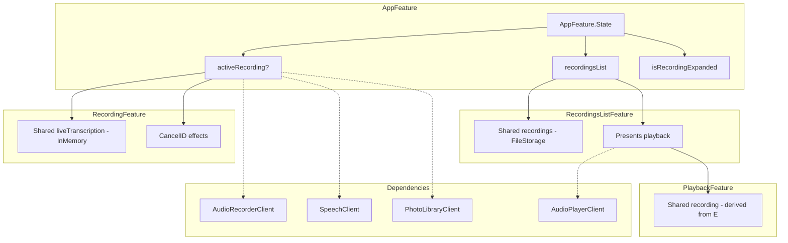
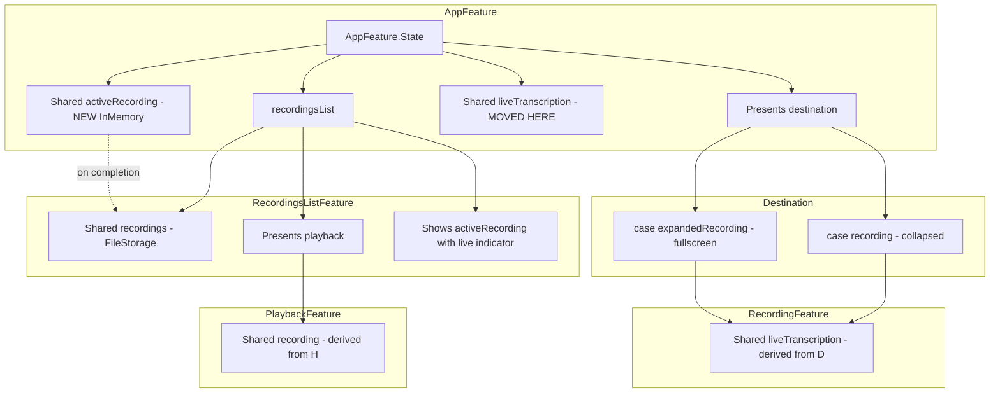

# SpeechRecorderApp TCA Audit Report

## Executive Summary

This audit compares the SpeechRecorderApp implementation against TCA best practices from the comprehensive guide. The app demonstrates **good foundational TCA patterns** but has several areas requiring improvement, particularly around **async stream lifecycle management**, **navigation patterns**, and **shared state architecture**.

**Key Feedback (2025-12-11):**
- Active recording should appear in recordings list immediately with live transcription preview
- When collapsed, the recordings list should show the ongoing recording with live indicator
- Shared state (`@Shared(.liveTranscription)`) should live at AppFeature level for destination control
- Focus on convenience initializers for previews, not just `.noop`
- Tests deferred for now - focus on critical and high priority items

---

## 1. Navigation Patterns Audit

### Current Implementation

**Location:** [`AppFeature.swift`](../apps/SpeechRecorderApp/SpeechRecorderApp/Features/AppFeature.swift)

The app uses a **custom modal pattern** rather than TCA's standard navigation patterns:

```swift
@ObservableState
struct State: Equatable {
    var recordingsList = RecordingsListFeature.State()
    var activeRecording: RecordingFeature.State?  // Optional child state
    var isRecordingExpanded = false  // Manual expansion tracking
}
```

**RecordingsListFeature** uses `@Presents` for playback:
```swift
/// Currently presented playback sheet
@Presents var playback: PlaybackFeature.State?
```

This is connected to the reducer body with `.ifLet`:
```swift
var body: some Reducer<State, Action> {
    Reduce { state, action in
        // ... action handling
    }
    .ifLet(\.$playback, action: \.playback) {
        PlaybackFeature()
    }
}
```

### Best Practice Reference

From the guide, **Multiple Destinations pattern** (lines 920-1019):

```swift
@Reducer(state: .equatable)
enum Destination {
    case alert(AlertState<Alert>)
    case addItem(AddItemFeature)
    case detail(DetailFeature)
}

@ObservableState
struct State: Equatable {
    @Presents var destination: Destination.State?
}
```

### ✅ What's Done Well

1. **`@Presents` usage** in RecordingsListFeature for playback sheet with proper `.ifLet` scoping
2. **Delegate pattern** for child-to-parent communication (see Section 1.1 below)
3. **AlertState** usage for permission and active recording alerts
4. **`.ifLet` scoping** for child reducers (playback, fullscreenTranscript)

### 1.1 Delegate Pattern Deep Dive

**Location:** [`RecordingFeature.swift:251-255`](../apps/SpeechRecorderApp/SpeechRecorderApp/Features/RecordingFeature.swift:251)

The delegate pattern enables child-to-parent communication without tight coupling:

```swift
/// Delegate actions for parent feature
case delegate(Delegate)

@CasePathable
enum Delegate: Equatable, Sendable {
    /// Called when recording completes (success or failure)
    case didFinish(Result<Recording, RecordingError>)
}
```

**How it works:**
1. Child reducer (`RecordingFeature`) sends delegate action when recording completes
2. Parent reducer (`AppFeature`) intercepts and handles the delegate action
3. Parent can then update its own state (add recording to list, clear active recording)

**Parent handling in AppFeature.swift:172-177:**
```swift
case .activeRecording(.delegate(.didFinish(let result))):
    /// Recording finished - save to list and clear active recording
    state.activeRecording = nil
    state.isRecordingExpanded = false
    return .send(.recordingFinished(result))
```

**Why this pattern:**
- Child doesn't need to know about parent's state structure
- Parent can decide how to handle the result (save, discard, show error)
- Enables reuse of child feature in different contexts
- Testable - can verify delegate actions are sent correctly

### ⚠️ Violations & Improvements Needed

| Issue | Location | Best Practice | Consequence |
|-------|----------|---------------|-------------|
| Manual `isRecordingExpanded` boolean | AppFeature.swift:71 | Use `@Presents` with Destination enum | State can become inconsistent; harder to test |
| No `@Reducer enum Destination` | AppFeature.swift | Consolidate all destinations | Multiple optional states instead of single source of truth |
| Active recording not in recordings list | AppFeature.swift | Create entry immediately on start | User can't see ongoing recording when collapsed |

### Recommended Fix: Destination Enum Pattern

```swift
@Reducer
struct AppFeature {
    @Reducer
    enum Destination {
        case recording(RecordingFeature)
        case expandedRecording(RecordingFeature)  // Same feature, different presentation
    }
    
    @ObservableState
    struct State: Equatable {
        var recordingsList = RecordingsListFeature.State()
        @Presents var destination: Destination.State?
        
        /// Shared live transcription - owned at app level for cross-feature access
        @Shared(.liveTranscription) var liveTranscription: LiveTranscriptionState
        
        var hasActiveRecording: Bool {
            if case .recording = destination { return true }
            if case .expandedRecording = destination { return true }
            return false
        }
        
        /// Computed: Is recording in collapsed mode?
        var isRecordingCollapsed: Bool {
            if case .recording = destination { return true }
            return false
        }
    }
    
    var body: some ReducerOf<Self> {
        Scope(state: \.recordingsList, action: \.recordingsList) {
            RecordingsListFeature()
        }
        Reduce { state, action in
            // Core logic
        }
        .ifLet(\.$destination, action: \.destination)
    }
}
```

---

## 2. Shared State Audit

### Current Implementation

**Location:** [`SharedKeys.swift`](../apps/SpeechRecorderApp/SpeechRecorderApp/SharedKeys/SharedKeys.swift)

```swift
extension SharedKey where Self == FileStorageKey<IdentifiedArrayOf<Recording>>.Default {
    static var recordings: Self {
        Self[.fileStorage(.documentsDirectory.appending(component: "recordings.json")), default: []]
    }
}

extension SharedKey where Self == InMemoryKey<LiveTranscriptionState>.Default {
    static var liveTranscription: Self {
        Self[.inMemory("liveTranscription"), default: LiveTranscriptionState()]
    }
}
```

**Usage in RecordingsListFeature:**
```swift
@Shared(.recordings) var recordings: IdentifiedArrayOf<Recording>
```

**Derived state in PlaybackFeature (RecordingsListFeature.swift:135-138):**
```swift
/// Derive shared state for the selected recording
guard let sharedRecording = Shared(state.$recordings[id: recordingID]) else {
    return .none
}
state.playback = PlaybackFeature.State(recording: sharedRecording)
```

### Best Practice Reference

From the guide, **Testing Shared State** section and Recipe 7:

```swift
// Parent derives shared state for child
case let .selectRecording(id):
    guard let recording = Shared($recordings[id: id]) else { return .none }
    state.playback = PlaybackFeature.State(recording: recording)
```

### ✅ What's Done Well

1. **FileStorage** for persistent recordings list
2. **InMemory** for volatile live transcription state
3. **Derived shared state** pattern with `Shared($recordings[id:])` - correctly implemented!
4. **`withLock`** usage for thread-safe mutations
5. **IdentifiedArrayOf** for O(1) lookups

### ⚠️ Violations & Improvements Needed

| Issue | Location | Best Practice | Consequence |
|-------|----------|---------------|-------------|
| `@Shared(.liveTranscription)` in RecordingFeature | RecordingFeature.swift:106 | Move to AppFeature for destination control | Can't control destinations based on live transcription state |
| Active recording not in recordings list | AppFeature | Create entry immediately, graduate to disk on completion | User can't see ongoing recording when collapsed |

### 2.1 New Requirement: Live Recording in List

**Problem:** When the recording modal is collapsed, the active recording doesn't appear in the recordings list. The user should see:
1. A list item for the ongoing recording with a "LIVE" indicator
2. The most recent transcription segment as a preview
3. Clicking the item should expand the recording modal (not open playback)

**Solution: In-Memory Recording with Disk Graduation**

```swift
/// SharedKeys.swift - Add in-memory key for active recording
extension SharedKey where Self == InMemoryKey<Recording?>.Default {
    static var activeRecording: Self {
        Self[.inMemory("activeRecording"), default: nil]
    }
}

/// AppFeature.swift - Own both shared states
@ObservableState
struct State: Equatable {
    var recordingsList = RecordingsListFeature.State()
    @Presents var destination: Destination.State?
    
    /// Live transcription state - owned at app level
    @Shared(.liveTranscription) var liveTranscription: LiveTranscriptionState
    
    /// Active recording (in-memory until completed)
    @Shared(.activeRecording) var activeRecording: Recording?
}
```

**Why in-memory for active recording:**
- Avoids disk thrashing during recording (transcription updates frequently)
- Recording is "graduated" to FileStorage only when completed
- If app crashes, in-progress recording is lost (acceptable trade-off)

**RecordingsListView changes:**
```swift
/// Show active recording at top of list if present
if let activeRecording = store.activeRecording {
    ActiveRecordingRow(
        recording: activeRecording,
        liveTranscription: store.liveTranscription
    )
    .onTapGesture {
        store.send(.expandActiveRecording)
    }
}

ForEach(store.recordings) { recording in
    RecordingRow(recording: recording)
}
```

### 2.2 Shared State Architecture Recommendation

Move `@Shared(.liveTranscription)` to AppFeature level:

```swift
/// AppFeature.swift
@ObservableState
struct State: Equatable {
    /// Shared live transcription - owned at app level
    @Shared(.liveTranscription) var liveTranscription: LiveTranscriptionState
    
    /// Destination states based on liveTranscription
    var recordingDestination: RecordingDestination {
        guard liveTranscription.isActive else { return .none }
        
        switch (isExpanded, isFullscreen) {
        case (true, false): return .expanded
        case (true, true): return .fullscreen
        case (false, _): return .collapsed
        }
    }
}
```

**Benefits:**
- Single source of truth for live transcription
- Destination can be computed from shared state
- RecordingFeature receives derived `Shared` reference
- FloatingIndicator can read directly from AppFeature

---

## 3. Effect Patterns Audit

### Current Implementation

**Location:** [`RecordingFeature.swift`](../apps/SpeechRecorderApp/SpeechRecorderApp/Features/RecordingFeature.swift)

```swift
private enum CancelID: Hashable {
    case recording
    case timer
    case audioLevels
    case transcription
    case photoObservation
}

// Effect merging
return .merge(
    startRecordingEffect(url: url, state: &state),
    startTimerEffect(),
    startAudioLevelMonitoring(),
    startTranscriptionEffect(url: url),
    startPhotoObservationEffect()
)
```

**Cancellation:**
```swift
case .stopButtonTapped:
    return .merge(
        .cancel(id: CancelID.timer),
        .cancel(id: CancelID.audioLevels),
        .cancel(id: CancelID.transcription),
        .cancel(id: CancelID.photoObservation),
        // ... stop effects
    )
```

### Best Practice Reference

From the guide, **Long-Living Effects** (lines 407-554):

```swift
// In the view
.task { await store.send(.task).finish() }

// In the reducer
case .task:
    return .run { send in
        for await _ in await self.screenshots() {
            await send(.userDidTakeScreenshot)
        }
    }
```

### ✅ What's Done Well

1. **CancelID enum** for type-safe cancellation
2. **Effect merging** with `.merge()` for concurrent effects
3. **`.cancellable(id:)`** on long-running effects
4. **Proper cancellation** on stop/cancel actions

### ⚠️ Critical Violations

| Issue | Location | Best Practice | Consequence |
|-------|----------|---------------|-------------|
| **No `.task` action** | RecordingFeature.swift | Use `.task` with `.finish()` in view | Effects not tied to view lifecycle |
| **No `defer` for cleanup** | startRecordingEffect | Use `defer` for guaranteed cleanup | Resources may leak on cancellation |
| **No `catch is CancellationError`** | Transcription effect | Handle cancellation explicitly | Silent failures, no cleanup |

### Critical Fix: Task Lifecycle Pattern

**Current (Problematic):**
```swift
// In RecordingView - NO lifecycle management
Button("Record") {
    store.send(.recordButtonTapped)
}
```

**Recommended:**
```swift
// RecordingFeature.swift
enum Action {
    case task  // Add this
    case recordButtonTapped
    // ...
}

case .task:
    // Start long-living observation effects here
    return .run { send in
        for await photo in self.photoLibrary.observeNewPhotos() {
            await send(.newPhotoDetected(photo))
        }
    }

// RecordingView.swift
var body: some View {
    RecordingContent(store: store)
        .task { await store.send(.task).finish() }  // Tie to view lifecycle
}
```

### Critical Fix: Cleanup with defer

**Current:**
```swift
private func startRecordingEffect(url: URL, state: inout State) -> Effect<Action> {
    return .run { send in
        for await buffer in try await self.audioRecorder.startRecording(url) {
            // Process buffer
        }
    }
}
```

**Recommended:**
```swift
private func startRecordingEffect(url: URL, state: inout State) -> Effect<Action> {
    return .run { send in
        defer {
            // Guaranteed cleanup
            Task { @MainActor in
                await self.audioRecorder.stopRecording()
            }
        }
        
        do {
            for await buffer in try await self.audioRecorder.startRecording(url) {
                await send(.audioBufferReceived(buffer))
            }
        } catch is CancellationError {
            // Handle cancellation - cleanup already handled by defer
            await send(.recordingCancelled)
        } catch {
            await send(.recordingFailed(error))
        }
    }
    .cancellable(id: CancelID.recording)
}
```

---

## 4. Dependency Management Audit

### Current Implementation

**Location:** [`Dependencies/`](../apps/SpeechRecorderApp/SpeechRecorderApp/Dependencies/)

```swift
// AudioRecorderClient.swift
@DependencyClient
public struct AudioRecorderClient: Sendable {
    public var requestRecordPermission: @Sendable () async -> Bool = { false }
    public var startRecording: @Sendable (URL) async throws -> AsyncStream<AVAudioPCMBuffer>
    public var stopRecording: @Sendable () async -> Void
    // ...
}

extension AudioRecorderClient: TestDependencyKey {
    public static var testValue: Self { Self() }
    public static var previewValue: Self { Self() }
}
```

### Best Practice Reference

From the guide, **Dependency Client Examples** (lines 1486-2800):

```swift
// Pattern from isowords - convenience initializers for different scenarios
extension AudioPlayerClient {
    /// For previews that need to show dynamic behavior
    public static func preview(
        isPlaying: Bool = false,
        currentTime: TimeInterval = 0
    ) -> Self {
        Self(
            play: { _ in },
            stop: {},
            currentTime: { currentTime },
            isPlaying: { isPlaying }
        )
    }
    
    /// For tests with specific behavior
    public static func mock(
        playHandler: @escaping (URL) async -> Void = { _ in }
    ) -> Self {
        var client = Self()
        client.play = playHandler
        return client
    }
}
```

### ✅ What's Done Well

1. **`@DependencyClient` macro** used correctly
2. **Separate files** for interface, live, and test implementations
3. **`Sendable` conformance** on all clients
4. **Default values** provided for non-throwing closures

### ⚠️ Violations & Improvements Needed

| Issue | Location | Best Practice | Consequence |
|-------|----------|---------------|-------------|
| `previewValue = Self()` | TestKey files | Use convenience initializers with useful preview data | Previews show empty/default state |
| No convenience initializers | Clients | Add static factories for common configs | Test/preview setup is verbose |
| Missing `.noop` as base | All clients | Provide `.noop` as a starting point | Harder to build custom configurations |

### Recommended Fix: Convenience Initializers Pattern

The goal is to make previews **useful** by showing realistic data, not just empty states.

```swift
// AudioRecorderClient+TestKey.swift
extension AudioRecorderClient: TestDependencyKey {
    /// Tests get unimplemented closures that fail loudly
    public static let testValue = Self()
    
    /// Previews get a working mock that shows realistic behavior
    public static let previewValue = Self.preview()
}

extension AudioRecorderClient {
    /// Base no-op implementation - all closures do nothing
    public static let noop = Self(
        requestRecordPermission: { true },
        startRecording: { _ in AsyncStream { $0.finish() } },
        stopRecording: {},
        pauseRecording: {},
        resumeRecording: {},
        currentTime: { nil },
        audioLevelStream: { AsyncStream { $0.finish() } }
    )
    
    /// Preview implementation with simulated recording behavior
    public static func preview(
        hasPermission: Bool = true,
        simulatedDuration: TimeInterval = 30
    ) -> Self {
        Self(
            requestRecordPermission: { hasPermission },
            startRecording: { _ in
                // Return a stream that simulates audio buffers
                AsyncStream { continuation in
                    // Simulate buffer events for preview
                    Task {
                        for _ in 0..<10 {
                            try? await Task.sleep(for: .milliseconds(100))
                            // Would yield mock buffer here
                        }
                        continuation.finish()
                    }
                }
            },
            stopRecording: {},
            pauseRecording: {},
            resumeRecording: {},
            currentTime: { simulatedDuration },
            audioLevelStream: {
                // Simulate audio levels for waveform preview
                AsyncStream { continuation in
                    Task {
                        for i in 0..<100 {
                            try? await Task.sleep(for: .milliseconds(50))
                            let level = Float.random(in: 0.1...0.8)
                            continuation.yield(level)
                        }
                        continuation.finish()
                    }
                }
            }
        )
    }
    
    /// Convenience for tests that need specific permission behavior
    public static func withPermission(_ granted: Bool) -> Self {
        var client = Self.noop
        client.requestRecordPermission = { granted }
        return client
    }
    
    /// Convenience for tests that need to verify recording was started
    public static func recording(
        onStart: @escaping (URL) -> Void = { _ in },
        onStop: @escaping () -> Void = {}
    ) -> Self {
        var client = Self.noop
        client.startRecording = { url in
            onStart(url)
            return AsyncStream { $0.finish() }
        }
        client.stopRecording = onStop
        return client
    }
}
```

### 4.1 SpeechClient Convenience Initializers

```swift
extension SpeechClient {
    /// Preview with simulated transcription
    public static func preview(
        transcriptionText: String = "This is a preview transcription..."
    ) -> Self {
        Self(
            requestAuthorization: { .authorized },
            startTranscription: { _ in
                AsyncThrowingStream { continuation in
                    Task {
                        // Simulate words appearing over time
                        let words = transcriptionText.split(separator: " ")
                        for (index, word) in words.enumerated() {
                            try? await Task.sleep(for: .milliseconds(200))
                            let result = TranscriptionResult(
                                text: words[0...index].joined(separator: " "),
                                words: [],
                                isFinal: index == words.count - 1
                            )
                            continuation.yield(result)
                        }
                        continuation.finish()
                    }
                }
            },
            streamAudio: { _ in },
            finishTranscription: {}
        )
    }
}
```

---

## 5. Testing Coverage Audit

> **Note:** Tests are deferred for now. Focus on critical and high priority items first.

### Current Test Files

| File | Tests | Coverage |
|------|-------|----------|
| RecordingFeatureTests.swift | 22 tests | Good - covers main flows |
| PlaybackFeatureTests.swift | 12 tests | Good - covers playback and word highlighting |
| RecordingsListFeatureTests.swift | 4 tests | Minimal |
| AppFeatureTests.swift | 4 tests | Minimal |

### ⚠️ Missing Tests (Deferred)

| Missing Test | Priority | Reason |
|--------------|----------|--------|
| Effect cancellation tests | High | Verify effects cancel properly |
| Timer with TestClock | High | Current tests use ImmediateClock only |
| Transcription stream tests | High | Core feature untested |
| Navigation flow tests | Medium | Modal minimize/expand untested |

Tests will be addressed after critical architecture improvements are complete.

---

## 6. Additional Findings

### 6.1 Reducer Composition

**Current:** Uses `Scope` correctly for child reducers.

```swift
var body: some ReducerOf<Self> {
    Scope(state: \.recordingsList, action: \.recordingsList) {
        RecordingsListFeature()
    }
    Reduce { state, action in
        // ...
    }
}
```

**✅ Correct pattern.**

### 6.2 Binding Patterns

**Current:** Uses `@BindableState` and `BindingReducer` where needed.

**✅ Correct pattern.**

### 6.3 Action Naming

**Current:** Uses past tense for user actions (`recordButtonTapped`, `stopButtonTapped`).

**✅ Follows best practice.**

### 6.4 Delegate Actions

**Current:** RecordingFeature uses delegate pattern correctly:

```swift
@CasePathable
enum Delegate {
    case recordingCompleted(Recording)
}
case delegate(Delegate)
```

**✅ Correct pattern.**

---

## 7. Priority Improvement Plan

### Critical (Must Fix)

1. **Add `.task` action and view lifecycle binding**
   - Location: RecordingFeature, RecordingView
   - Impact: Effects not properly cancelled when view disappears
   - Reference: Guide lines 407-554

2. **Add `defer` and `CancellationError` handling**
   - Location: All effect functions in RecordingFeature
   - Impact: Resource leaks on cancellation
   - Reference: Guide lines 556-742

3. **Add `.noop` implementations to all dependency clients**
   - Location: All *Client+TestKey.swift files
   - Impact: Previews may crash
   - Reference: Guide lines 1686-1700

### High Priority

4. **Refactor AppFeature to use `@Reducer enum Destination`**
   - Location: AppFeature.swift
   - Impact: Cleaner navigation, better testability
   - Reference: Guide lines 920-1019

5. **Add effect cancellation tests**
   - Location: RecordingFeatureTests.swift
   - Impact: Verify cleanup works correctly

6. **Add TestClock-based timer tests**
   - Location: RecordingFeatureTests.swift
   - Impact: More precise timing control in tests

### Medium Priority

7. **Add transcription stream tests**
   - Location: RecordingFeatureTests.swift
   - Impact: Core feature coverage

8. **Add navigation flow tests**
   - Location: AppFeatureTests.swift
   - Impact: Modal behavior coverage

9. **Add convenience initializers to dependency clients**
   - Location: All client files
   - Impact: Easier test setup

### Low Priority

10. **Consider modularization following isowords pattern**
    - Impact: Better isolation, faster builds
    - Reference: Guide Modularization section

---

## 8. Architecture Diagram

### Current Architecture



### Proposed Architecture



**Key Changes:**
1. `@Shared(.liveTranscription)` moves to AppFeature
2. New `@Shared(.activeRecording)` for in-memory recording
3. Destination enum replaces manual `isRecordingExpanded` boolean
4. RecordingsListView shows active recording with live indicator
5. Active recording graduates to FileStorage on completion

---

## 9. Concrete Implementation Plan

Based on the audit and user feedback, here is the prioritized implementation plan:

### Phase 1: Critical Fixes

#### 1.1 Add `.task` Action and View Lifecycle Binding

**Files to modify:**
- `RecordingFeature.swift` - Add `.task` action
- `RecordingView.swift` - Add `.task { await store.send(.task).finish() }`

**Pattern:**
```swift
// RecordingFeature.swift
enum Action {
    case task  // NEW
    case recordButtonTapped
    // ...
}

case .task:
    // Start long-living observation effects here
    return .merge(
        startPhotoObservation(),
        startAudioLevelMonitoring()
    )

// RecordingView.swift
var body: some View {
    RecordingContent(store: store)
        .task { await store.send(.task).finish() }
}
```

#### 1.2 Add `defer` and `CancellationError` Handling

**Files to modify:**
- `RecordingFeature.swift` - All effect functions

**Pattern:**
```swift
private func startRecordingEffect(url: URL) -> Effect<Action> {
    .run { send in
        defer {
            Task { @MainActor in
                await self.audioRecorder.stopRecording()
            }
        }
        
        do {
            for await buffer in try await self.audioRecorder.startRecording(url) {
                await send(.audioBufferReceived(buffer))
            }
        } catch is CancellationError {
            await send(.recordingCancelled)
        } catch {
            await send(.recordingFailed(error))
        }
    }
    .cancellable(id: CancelID.recording)
}
```

#### 1.3 Add Convenience Initializers to Dependency Clients

**Files to modify:**
- `AudioRecorderClient.swift`
- `SpeechClient.swift`
- `PhotoLibraryClient.swift`
- `AudioPlayerClient.swift`

**Pattern:** See Section 4 above for detailed examples.

### Phase 2: High Priority - Architecture Improvements

#### 2.1 Refactor AppFeature to Use Destination Enum

**Files to modify:**
- `AppFeature.swift` - Replace `isRecordingExpanded` with `@Presents var destination`
- `ContentView.swift` - Update to use destination-based presentation

#### 2.2 Move Shared State to AppFeature Level

**Files to modify:**
- `AppFeature.swift` - Add `@Shared(.liveTranscription)` and `@Shared(.activeRecording)`
- `RecordingFeature.swift` - Receive derived shared state
- `SharedKeys.swift` - Add `.activeRecording` key

#### 2.3 Show Active Recording in Recordings List

**Files to modify:**
- `RecordingsListView.swift` - Add active recording row at top
- `RecordingsListFeature.swift` - Add action for expanding active recording
- Create `ActiveRecordingRow.swift` - New view component

**New behavior:**
1. When recording starts, create in-memory Recording entry
2. Display at top of recordings list with "LIVE" indicator
3. Show most recent transcription segment as preview
4. Tapping expands the recording modal (not playback)
5. On completion, graduate to FileStorage

---

## 10. Conclusion

The SpeechRecorderApp demonstrates **solid TCA fundamentals** with proper use of:
- `@Reducer` macro and `@ObservableState`
- `@DependencyClient` for dependency injection
- `@Shared` for persistent and in-memory state
- Delegate pattern for child-to-parent communication
- Effect cancellation with `CancelID`
- Derived shared state with `Shared($recordings[id:])`

**Critical gaps** that need immediate attention:
1. **Effect lifecycle management** - Effects are not tied to view lifecycle
2. **Cleanup handling** - No `defer` or `CancellationError` handling
3. **Preview convenience** - Missing convenience initializers for realistic previews

**Architecture improvements** for better UX:
1. **Destination enum** - Replace manual `isRecordingExpanded` boolean
2. **Shared state ownership** - Move `liveTranscription` to AppFeature
3. **Active recording in list** - Show ongoing recording with live indicator

Addressing these issues will significantly improve the app's reliability, testability, and user experience.